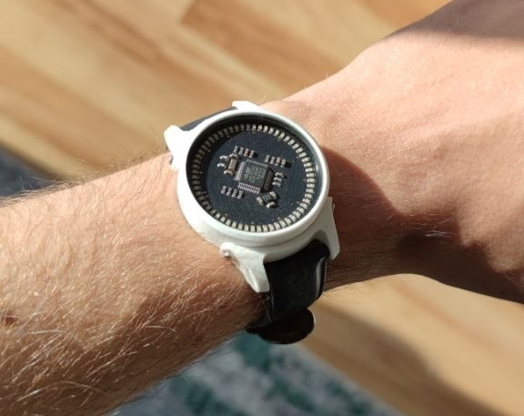

# Description

It's a wristwatch using LEDs to show the current time. This repository contains one major folder for the hardware part, which contains a KiCAD project with the schematics & PCB layout, as well as a FreeCAD project with 3D-printable parts for the case. You can find instructions on how to use each "part" of the repo in the subfolders.

# How it works

The watch has a (very) low power STM32 microcontroller, as well as a Bosch BMA400 accelerometer for user inputs. It also has a 32 kHz crystal for precise timekeeping. A ring of 60 LEDs shows the hour and minute hands when the watch is doubletapped on its X axis. When not displaying the time, all components are put into their lowest possible power modes, consuming ~9uA total. Since the device is powered by a single CR2032 or CR2016 coin cell on the back of the PCB, this results in a theoretical maximum runtime of up to ~2.9. I have not had time to test this fully, but my personal watch has been going strong on a single cell for around 7 months with daily use. Battery lifetime of course heavily depends on how often the display is activated.

# Design Goals

- Long battery life & Easy battery replacement
- Small diameter (currently 38mm without the case)
- Manufacturability (case is 3D-printable or machineable)
- Water-tightness
