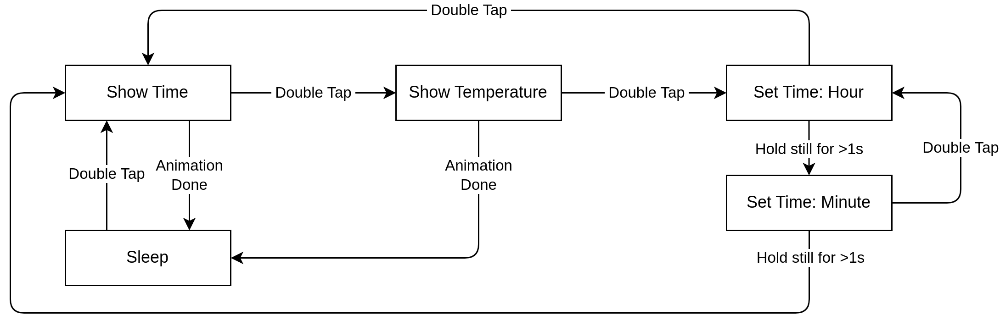

# Description

The firmware of the watch currently implements showing the time and temperature, as well as setting the time. Every LED display feature has some neat animations where the lit up LED "runs" to the new target over some period of time.

Everything is built ontop of a custom HAL layer which uses only CMSIS headers as a dependency. As such, the firmware is fully self-contained as it is within the repo, with no other external dependencies.

# Prerequisites

- ARM compiler toolchain (`arm-none-eabi-xxx`)
- GNU Make
- Debugger/Programmer
- Needle adapter or soldering iron & wires

You will need an ARM compiler to build the firmware. The build process is done using a single Makefile. To flash the code to the device, you'll also need a programmer or debugger. I personally use a JLink one within VS Code, so there's a configuration for that in the project. The hardware currently only has testpoints for attaching a debugger via SWD, but they're quite big and can easily be soldered to.

# Getting started

To compile, just go into the `software` folder and do

`make`

This should output a finished binary at `software/bin/main.elf`.

# Using the firmware

The firmware implements the following state machine for its UX:

